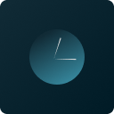

### <i>NOVASOLARIZED</i>

<i>Display current time on statusbar.</i>

<i>dark colorscheme for vscode based on:
[Solarized](https://ethanschoonover.com/solarized) and [NeoSolarized](https://github.com/overcache/NeoSolarized).
</i>

#### <i>License</i>

<i>[MIT License](LICENSE)</i>

#### <i>More Extentions:</i>

<i>You can also check: [NovaSolarized](https://marketplace.visualstudio.com/items?itemName=injty.novasolarized) and [NovaClock](https://marketplace.visualstudio.com/items?itemName=injty.novaclock).</i>
